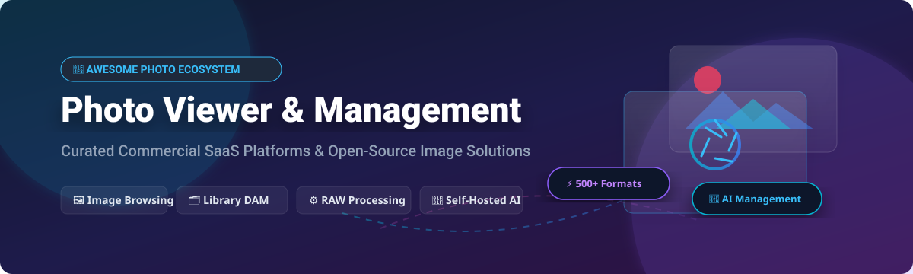

# 📸 Awesome Photo Viewer & Management Ecosystem 🚀

    

A comprehensive, curated guide to top commercial **SaaS platforms** and **open-source projects** for photo viewing, digital asset management (DAM), RAW processing, and image library organization.

---

## 📑 Table of Contents
- [📊 Market Overview & Industry Analysis](#-market-overview--industry-analysis)
- [🏢 SaaS & Commercial Platforms](#-saas--commercial-platforms)
- [💻 Open-Source GitHub Projects](#-open-source-github-projects)
- [🤝 How to Contribute](#-how-to-contribute)
- [💖 Support & Sponsorship](#-support--sponsorship)
- [⚖️ Disclaimer & Privacy Notes](#-disclaimer--privacy-notes)
- [⭐ Star History](#-star-history)

---

## 📊 Market Overview & Industry Analysis

> 📈 **Estimated Market Size**: The global Digital Asset Management (DAM) & Photo Management Software market is estimated at **$4.8 Billion** and is projected to reach **$10.2 Billion by 2030** (CAGR of ~11.5%).
> 
> 🧩 **Market Fragmentation**: The consumer cloud photo sector is **highly concentrated** (winner-take-all dynamics dominated by big-tech giants like Apple, Google, and Adobe), whereas the local desktop viewer, professional RAW processing, and self-hosted privacy-focused ecosystem remain **highly fragmented** with specialized open-source and independent solutions.

---

## 🏢 SaaS & Commercial Platforms

Below is a curated comparison of major commercial photo viewing, cloud storage, and digital asset management platforms. The table is ordered by company revenue / valuation in descending order.

| Platform | Enterprise / Company | Revenue / Valuation | Starting Paid Tier Price | Free Tier / Trial Limit | Key Features & Target Use Case |
| :--- | :--- | :--- | :--- | :--- | :--- |
| 🪟 **[Windows Photos](https://www.microsoft.com/en-us/p/microsoft-photos/9wzdncrfjbh4)** | Microsoft ($MSFT) | ~$245 Billion Revenue | $6.99/mo (Microsoft 365 Personal) | Free forever (Pre-installed with Windows OS, 5GB OneDrive storage limit) | Built-in Windows photo viewer & editor with basic crop, filter, and cloud sync features. |
| 🔍 **[Google Photos](https://photos.google.com/)** | Alphabet / Google ($GOOGL) | ~$307 Billion Revenue | $1.99/mo (Google One 100GB plan) | Free forever (15GB shared pool across Drive/Gmail/Photos) | AI-powered facial recognition, semantic search, automatic album creation, and mobile cloud backup. |
| 🍎 **[Apple Photos](https://www.apple.com/ios/photos/)** | Apple Inc. ($AAPL) | ~$383 Billion Revenue | $0.99/mo (iCloud+ 50GB plan) | Free forever (5GB iCloud storage limit across Apple ecosystem) | Native macOS/iOS library management with Memories, Live Photos, iCloud sync, and hardware acceleration. |
| 🎨 **[Adobe Lightroom](https://www.adobe.com/products/photoshop-lightroom.html)** | Adobe Inc. ($ADBE) | ~$19.4 Billion Revenue | $9.99/mo (Lightroom 1TB Plan) | 7-day free trial (Full feature access during trial period) | Industry-standard non-destructive RAW processing, cloud cataloging, preset management, and pro color grading. |
| 🗂️ **[ACDSee Photo Studio](https://www.acdsee.com/)** | ACD Systems | ~$25 Million Revenue | $8.99/mo or $149.99 one-time license | 30-day free trial (Full feature access with no credit card required) | Professional digital asset management (DAM), layer editing, batch file renamed, and RAW editing suite. |
| 📷 **[Mylio Photos](https://www.mylio.com/)** | Mylio LLC | ~$10 Million Revenue | $9.99/mo or $99.99/year | Free forever (Mylio Photos Free tier allows basic local viewing & sync up to 3 devices) | Peer-to-peer cross-device photo library synchronization without mandatory cloud storage dependencies. |
| 🚀 **[IrfanView](https://www.irfanview.com/)** | Irfan Skiljan | ~$2 Million Revenue | $12.00 one-time (Commercial use license) | Free forever (Non-commercial personal use, 100% full features without time limit) | Ultra-fast lightweight Windows viewer supporting 100+ file formats, batch image conversion, and plugins. |
| ⚡ **[FastStone Image Viewer](https://www.faststone.org/)** | FastStone Soft | ~$1 Million Revenue | $34.95 one-time (Commercial license) | Free forever (Non-commercial personal & educational use, full feature access) | High-speed Windows image browser, converter, and editor with split-screen image comparison features. |

---

## 💻 Open-Source GitHub Projects

Open-source photo viewers and self-hosted managers provide full data privacy, customizable workflows, and self-sovereignty. Below is a curated list of top open-source projects sorted by **GitHub Stars_Count** (descending).

| Project Name | GitHub_Stars | License | Key Features & Target Use Case |
| :--- | :--- | :--- | :--- |
| ⚡ **[Immich](https://github.com/immich-app/immich)** |  | AGPL-3.0 | High-performance self-hosted backup & management solution with facial recognition, object detection, and mobile apps (Google Photos alternative). |
| 📸 **[PhotoPrism](https://github.com/photoprism/photoprism)** |  | AGPL-3.0 | AI-powered Web-based photo app for browsing, organizing, and sharing image collections powered by TensorFlow. |
| 🖼️ **[ImageGlass](https://github.com/d2phap/ImageGlass)** |  | GPL-3.0 | Lightweight, versatile open-source image viewer for Windows designed to replace default photo viewers with support for 80+ image formats. |
| 🎯 **[Darktable](https://github.com/darktable-org/darktable)** |  | GPL-3.0 | Professional open-source photography workflow application and RAW developer for Linux, macOS, and Windows (Adobe Lightroom open-source alternative). |
| 🍃 **[LibrePhotos](https://github.com/LibrePhotos/librephotos)** |  | MIT | Self-hosted open-source photo management service with intelligent multi-vector face recognition, location timeline, and album generation. |
| 🌟 **[Lychee](https://github.com/LycheeOrg/Lychee)** |  | MIT | Sleek and elegant self-hosted photo-management system running on PHP/Laravel for quick uploading, managing, and sharing photo galleries. |
| 🌄 **[Photoview](https://github.com/photoview/photoview)** |  | AGPL-3.0 | User-friendly self-hosted photo gallery aimed at photographers with RAW file support, facial recognition, and map coordinates integration. |
| 🎨 **[RawTherapee](https://github.com/RawTherapee/RawTherapee)** |  | GPL-3.0 | Advanced non-destructive 96-bit processing engine for RAW digital camera photographs with state-of-the-art demosaicing algorithms. |
| 🌐 **[Piwigo](https://github.com/Piwigo/Piwigo)** |  | GPL-2.0 | Mature open-source web photo gallery software used by organizations, teams, and individual photographers worldwide. |
| 🔍 **[OpenSeadragon](https://github.com/openseadragon/openseadragon)** |  | BSD-3-Clause | An open-source, web-based canvas viewer for high-resolution smooth zoomable images with deep-zoom tile engine support. |
| 🖥️ **[qView](https://github.com/jurplel/qView)** |  | GPL-3.0 | Practical and minimal image viewer designed to be visually non-intrusive, space-efficient, and cross-platform (Qt-based). |
| 💻 **[viu](https://github.com/atanunq/viu)** |  | MIT | Terminal image viewer written in Rust using iTerm2 / Kitty graphics protocol or unicode blocks. |
| 🔮 **[Nomacs](https://github.com/nomacs/nomacs)** |  | GPL-3.0 | Fast, lightweight cross-platform image viewer that handles RAW images, zip archives, and side-by-side synchronized view comparison. |
| 🐧 **[feh](https://github.com/derf/feh)** |  | MIT | Fast and light X11 image viewer targeted primarily at command line users with customizable keybindings and slideshow modes. |
| 🚀 **[thumbsup](https://github.com/thumbsup/thumbsup)** |  | MIT | Static HTML photo & video gallery generator for self-hosting on AWS S3, GitHub Pages, or any static HTTP web server. |
| 📁 **[DigiKam](https://github.com/KDE/digikam)** |  | GPL-2.0 | Professional open-source desktop photo management suite with SQLite/MySQL database support, geolocation, and LibRaw processing. |
| 🖼️ **[Geeqie](https://github.com/BestImageViewer/geeqie)** |  | GPL-2.0 | Lightweight GTK-based image viewer and manager with EXIF metadata viewing, thumbnail caching, and external editor integration. |
| 🦅 **[Shotwell](https://github.com/GNOME/shotwell)** |  | LGPL-2.1 | Default GNOME photo organizer and viewer supporting digital camera importing, event categorization, and publishing to web services. |
| 🌟 **[gThumb](https://github.com/GNOME/gthumb)** |  | GPL-2.0 | Feature-rich GNOME image browser and viewer supporting WebP/AVIF formats, catalog management, and seamless image manipulation. |
| ⚡ **[Rapid Photo Downloader](https://github.com/damonlynch/rapid-photo-downloader)** |  | GPL-3.0 | Specialized tool built for professional photographers to import photos & videos concurrently from cameras, memory cards, and portable drives. |
| 📱 **[Gwenview](https://github.com/KDE/gwenview)** |  | GPL-2.0 | Fast and simple image viewer for the KDE Plasma desktop with slideshow, rating system, and video playback features. |
| 👁️ **[Eye of GNOME (eog)](https://github.com/GNOME/eog)** |  | GPL-2.0 | Official image viewer program for the GNOME desktop environment focusing on simplicity and standards compliance. |
| 🏷️ **[KPhotoAlbum](https://github.com/KDE/kphotoalbum)** |  | GPL-2.0 | KDE photo management application specialized for tagging, grouping, and indexing large photo collections with SQL backend. |

---

## 🤝 How to Contribute

Contributions are warmly welcomed! Help us keep this curated list complete and up-to-date:

1. **Fork** this repository.
2. Add your suggested photo viewer, SaaS platform, or open-source software to `README.md`.
3. Ensure open-source projects include Stars_Badges linked directly to their `/stargazers` page.
4. Submit a **Pull Request** with a brief summary of the added project.

---

## 💖 Support & Sponsorship

If you find this repository helpful, please consider supporting the project! Your contributions help maintain and expand this curated ecosystem list.

- ⭐️ **Star** this repository to give it visibility.
- 🔀 **Fork** and share it with fellow photographers and developers.
- ☕ **Buy me a coffee**: Support ongoing open-source development via the [GitHub Sponsors Dashboard](https://github.com/sponsors/ishandutta2007).

---

## ⚖️ Disclaimer & Privacy Notes

- **Community Curated**: This repository is a community-maintained curated list and is not affiliated with or endorsed by any software vendor listed.
- **Data Privacy & Cloud Storage**: Commercial SaaS solutions (e.g., Google Photos, Apple Photos) process and index files on third-party servers. Check terms of service for privacy compliance.
- **Self-Hosted Security**: Self-hosted solutions (Immich, PhotoPrism, LibrePhotos) guarantee data sovereignty; ensure reverse proxies and SSL encryption are configured securely.

---

## 📈 Star History

---

<b>Made with ❤️ for photographers, archivists, open-source enthusiasts, and digital asset managers worldwide.</b>

